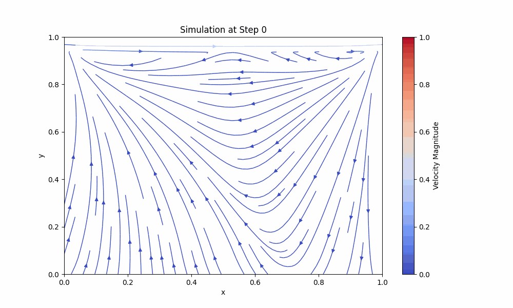

# 2D Eulerian Fluid Simulation



This project simulates the flow of a two-dimensional incompressible fluid using the Eulerian approach and finite difference methods. The simulation is based on the Navier-Stokes equations, which describe the motion of fluid substances. For this demonstration, we assume:

1. The fluid is Newtonian, meaning viscosity is constant.
2. The fluid is incompressible, so density remains constant.
3. The fluid is isothermal, making temperature irrelevant.
4. No external forces are applied.
5. The system is two-dimensional.
6. The fluid is contained in a box where all walls have no velocity, except for the top wall, which moves.

> 🌎 Este documento também está disponível em [Português](docs/README.pt.md).

---

## Features
- Numerical solution of the Navier-Stokes equations for 2D incompressible fluid flow.
- Explicit time-stepping scheme for temporal evolution.
- Finite difference methods for spatial discretization.
- Gauss-Seidel iterative solver for the pressure-Poisson equation.
- Visualization of velocity fields and flow dynamics.

---

## Documentation

Detailed documentation, including equations, methodology, and examples, is available on the [GitHub Pages site](https://bm-coelho.github.io/physics-trab/).


## How to Run

### Prerequisites
- Python 3.8+ with the following libraries:
  - `numpy`
  - `matplotlib`
  - `tqdm`
  - `Pillow`

### Instructions
1. Clone the repository:
   ```bash
   git clone https://github.com/your-repo/fluid-simulation.git
   cd fluid-simulation
   ```

2. Install dependencies:
   ```bash
   pip install -r requirements.txt
   ```
   
3. Open the Jupyter Notebook:
   ```bash
   jupyter notebook main.ipynb
   ```

4. Run all cells in the notebook to execute the simulation and generate visualizations.

---

## References

1. Bitiușcă, L.-G. (2016). *Eulerian Fluid Simulator*. MSc thesis, Bournemouth University.
2. Saad, M. (2024 & 2019). *Computational Fluid Dynamics Lessons*. University of Utah. Available at [YouTube Playlist](https://www.youtube.com/playlist?list=PLEaLl6Sf-KICvBLrYFwt5h_LgedJyN59n).
3. Bridson, R. (2015). *Fluid Simulation for Computer Graphics*. CRC Press.

