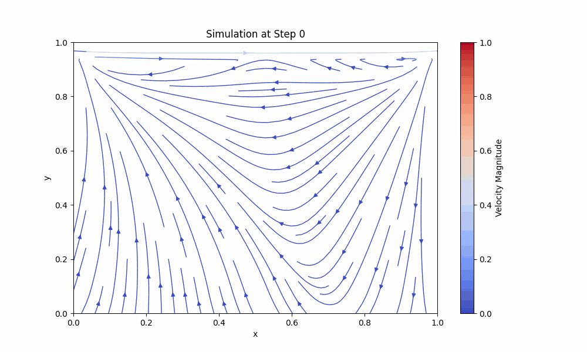
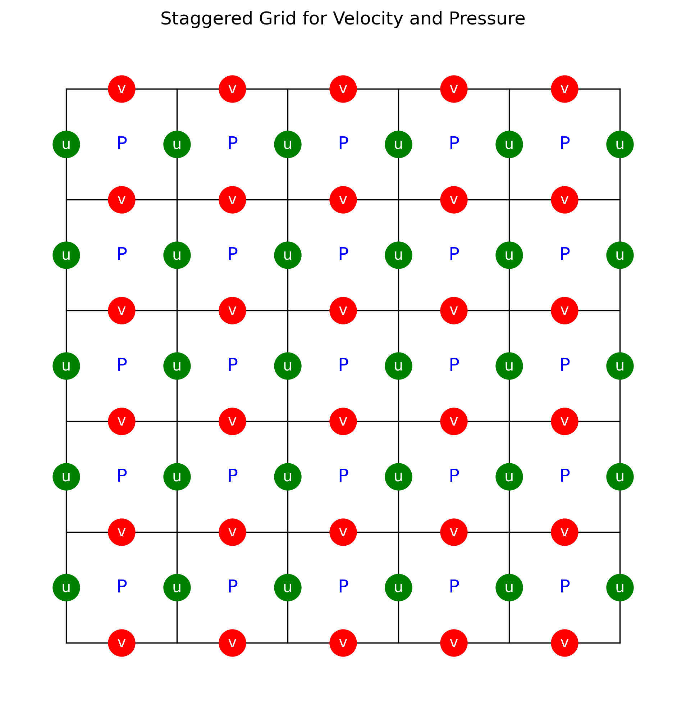
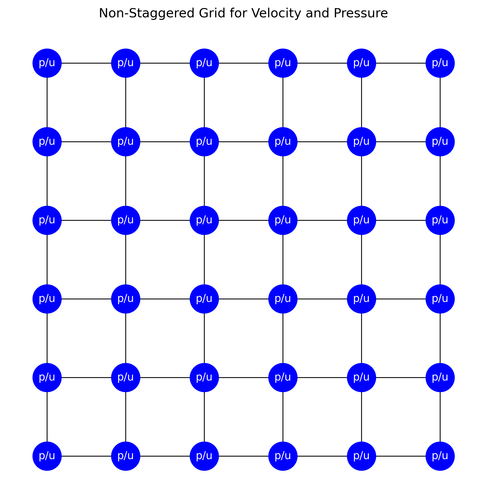
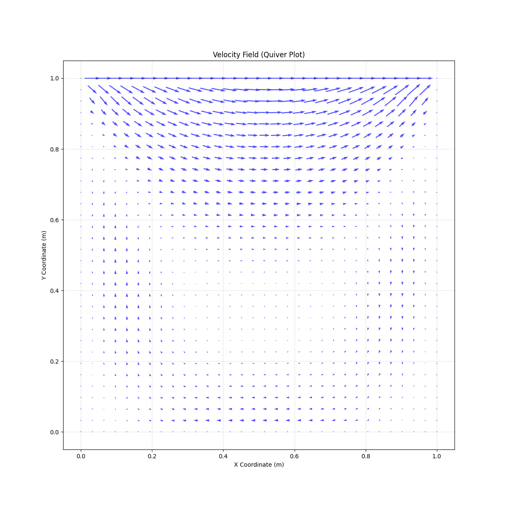
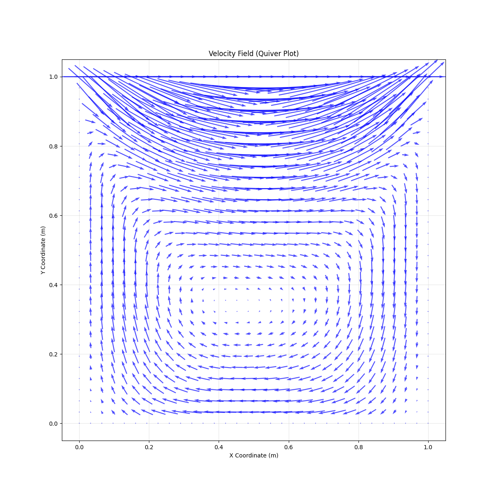
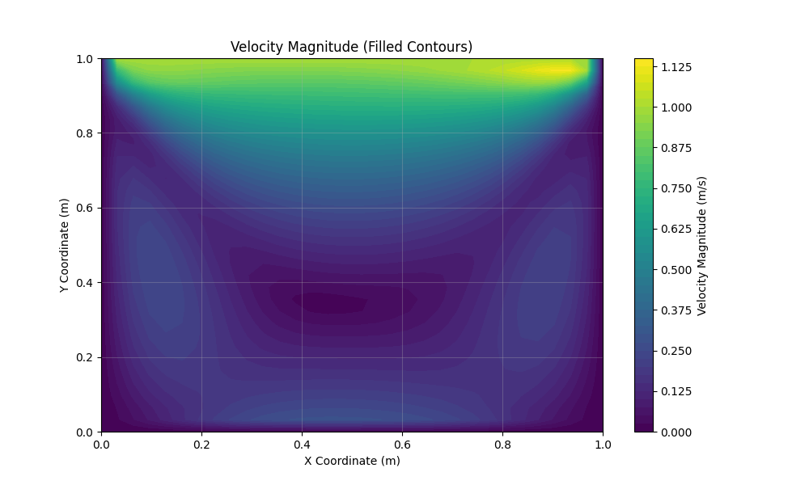
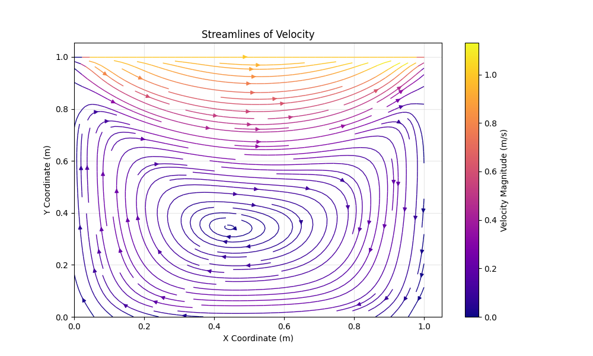
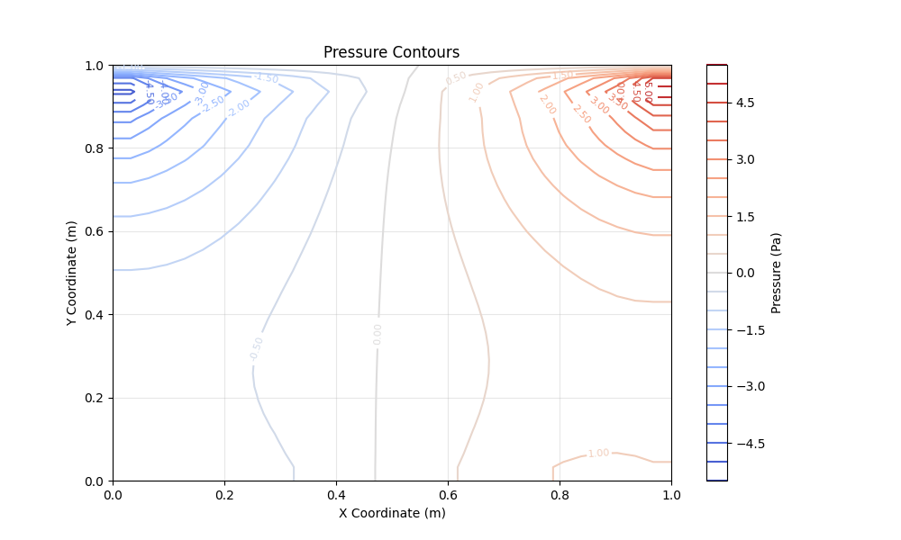

# Simulação de Fluido Bidimensional Euleriana



Este projeto simula o fluxo de um fluido incompressível bidimensional usando a abordagem Euleriana e métodos de diferenças finitas. A simulação é baseada nas equações de Navier-Stokes, que descrevem o movimento de substâncias fluidas. Para esta demonstração, assumimos:

1. O fluido é Newtoniano, ou seja, a viscosidade é constante.
2. O fluido é incompressível, de forma que a densidade permanece constante.
3. O fluido é isotérmico, tornando a temperatura irrelevante.
4. Nenhuma força externa é aplicada.
5. O sistema é bidimensional.
6. O fluido está contido em uma caixa onde todas as paredes não têm velocidade, exceto a parede superior, que se move.

> 🌎 Este documento também está disponível em [Inglês](docs/README.en.md).

---

## Recursos
- Solução numérica das equações de Navier-Stokes para fluxo de fluido incompressível bidimensional.
- Esquema explícito de passos no tempo para evolução temporal.
- Métodos de diferenças finitas para discretização espacial.
- Solucionador iterativo de Gauss-Seidel para a equação de pressão-Poisson.
- Visualização de campos de velocidade e dinâmica do fluxo.

---

## Equações Governantes

O comportamento do fluido é governado pelas equações de Navier-Stokes:

1. **Conservação de Momento**:
   $$
   \rho \frac{\partial \vec{u}}{\partial t} + \rho (\vec{u} \cdot \nabla) \vec{u} = -\nabla p + \mu \nabla^2 \vec{u} + \vec{F},
   $$
   onde:
   - $\rho$: densidade do fluido
   - $\vec{u} = (u, v)$: vetor de velocidade
   - $p$: campo de pressão
   - $\mu$: viscosidade dinâmica
   - $\vec{F}$: forças externas

2. **Equação de Continuidade**:
   $$
   \nabla \cdot \vec{u} = 0,
   $$
   que impõe a condição de incompressibilidade.

---

## A Grade Computacional

O domínio computacional é discretizado em uma grade cartesiana uniforme. Cada célula representa uma unidade espacial discreta do domínio do fluido. Os componentes de velocidade $u$ e $v$ estão deslocados, definidos nas bordas das células, enquanto a pressão $p$ é definida nos centros das células.

Essa estrutura de grade deslocada minimiza oscilações espúrias de pressão e garante estabilidade numérica. Abaixo está um diagrama simplificado que ilustra a estrutura da grade em representações deslocadas e não deslocadas.





### Estrutura da Grade

- **Pressão $p$:** Armazenada no centro de cada célula da grade.
- **Velocidade $u$:** Definida nas bordas horizontais das células.
- **Velocidade $v$:** Definida nas bordas verticais das células.

---

## Métodos Numéricos

### Discretização Espacial

As equações são discretizadas usando métodos de diferenças finitas:

- **Derivadas de primeira ordem** (por exemplo, para termos convectivos):
  $$
  \frac{\partial u}{\partial x} \approx \frac{u_{i+1,j} - u_{i-1,j}}{2 \Delta x}.
  $$

- **Derivadas de segunda ordem** (por exemplo, para termos difusivos):
  $$
  \frac{\partial^2 u}{\partial x^2} \approx \frac{u_{i+1,j} - 2u_{i,j} + u_{i-1,j}}{\Delta x^2}.
  $$

- **Equação de Pressão-Poisson**:
  $$
  \nabla^2 p = \rho \left( \frac{\partial u}{\partial x} + \frac{\partial v}{\partial y} \right),
  $$
  resolvida iterativamente usando o método de Gauss-Seidel.

### Integração no Tempo

A evolução temporal é calculada usando passos no tempo explícitos, com o tamanho do passo ($\Delta t$) determinado por:

1. **Condição de CFL**:
   $$
   \Delta t < \frac{\Delta x}{\text{max}(|u|)}.
   $$

2. **Restrição de estabilidade viscosa**:
   $$
   \Delta t < \frac{\rho \Delta x^2}{\mu}.
   $$

O menor valor é escolhido para garantir a estabilidade.

---

## Visualização

### Exemplos de Saídas

1. **Campo de Velocidade**:











   - Magnitude da velocidade ao longo da grade computacional. A segunda imagem possui uma escala ampliada.

2. **Linhas de Corrente**:





   - Destaca os padrões de fluxo no domínio.

3. **Distribuição de Pressão**:




   - Visualiza o campo de pressão no domínio da simulação.

---

## Como Executar

### Pré-requisitos
- Python 3.8+ com as seguintes bibliotecas:
  - `numpy`
  - `matplotlib`
  - `tqdm`
  - `Pillow`

### Instruções
1. Clone o repositório:
   ```bash
   git clone https://github.com/your-repo/fluid-simulation.git
   cd fluid-simulation
   ```

2. Instale as dependências:
   ```bash
   pip install -r requirements.txt
   ```

3. Abra o Jupyter Notebook:
   ```bash
   jupyter notebook main.ipynb
   ```

4. Execute todas as células no notebook para rodar a simulação e gerar as visualizações.

---

## Referências

1. Bitiușcă, L.-G. (2016). *Eulerian Fluid Simulator*. MSc thesis, Bournemouth University.
2. Saad, M. (2024 & 2019). *Computational Fluid Dynamics Lessons*. University of Utah. Disponível em [YouTube Playlist](https://www.youtube.com/playlist?list=PLEaLl6Sf-KICvBLrYFwt5h_LgedJyN59n).
3. Bridson, R. (2015). *Fluid Simulation for Computer Graphics*. CRC Press.

---

## Licença

Este projeto está licenciado sob a licença MIT. Veja o arquivo [LICENSE](../LICENSE) para mais detalhes.
